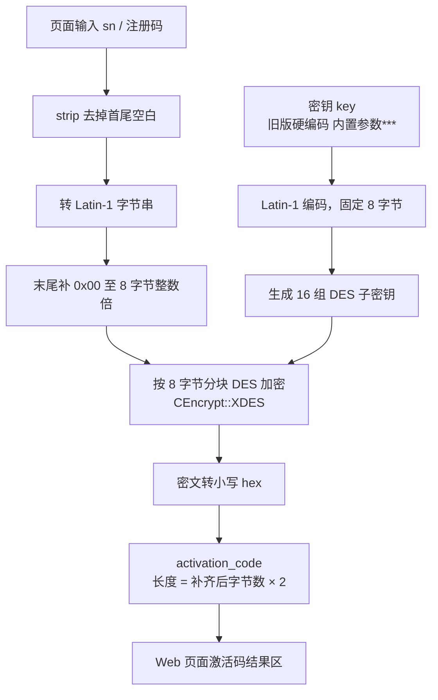

# RegMachine Web

这是把旧版 Qt/C++ `RegMachine` 注册机改成 Web 操作台的 Flask 版本，页面和目录组织参考 `E:\BB_pro\gitHub\tool100_automail`。

## 功能

- Web 页面输入注册码与密钥，生成激活码；内置密钥来自 `REGISTER_KEY` 环境变量。
- 密钥支持下拉选择：内置项、本地历史缓存、自定义输入。
- 激活码逻辑复刻旧版 `genbtn`：对注册码输入做 DES/XDES 加密。
- 提供 JSON API 与命令行客户端，供外部系统调用。
- 使用 Git tag 自动发布到 Vercel。

## 设计流程图

### 激活码关键步骤（Web 页面 / 旧版 genbtn）

旧版只对 `sn` 输入框内容做 DES，**不使用机器码 MD5 结果**；输出写入 `regcodeEdit`（界面标签为激活码）。



### 目录结构

```text
registerTool/
├── app.py                  # Flask 路由与错误处理
├── call_api.py             # API 命令行客户端
├── api/
│   └── routes.py           # /api 路由与 CORS
├── client/
│   └── register_client.py  # 可复用 Python API 客户端
├── config.py               # 读取 .env 配置
├── services/
│   └── register_service.py # DES 核心算法
├── templates/
│   └── index.html          # Web 操作台页面
├── static/
│   ├── css/main.css
│   └── js/main.js          # 调用 /api/register-code
├── env.example             # 配置模板
├── Vercel发版说明.md        # Vercel 生产发版步骤（tag 触发 CI/CD）
├── vercel.json             # 关闭 main 自动部署，改由 tag 触发 CI/CD
├── .vercelignore
├── .github/workflows/main.yml
└── requirements.txt
```

## 兼容说明

旧版源码位置：`E:\BB_pro\code\RegMachine\registerdlg.cpp`

- 输入：`sn` 文本框（界面标签为注册码）
- 算法：`CEncrypt::XDES`，密钥为内置参数
- 输出：`regcodeEdit`（界面标签为激活码）

Web 版仅保留上述激活码生成流程；旧版顶部的机器码 MD5（`genbtn_2`）未纳入 Web 与本文档。

## 本地运行

```powershell
cd E:\BB_pro\gitHub\registerTool
py -m pip install -r requirements.txt
py app.py
```

打开：

```text
http://localhost:9212
```

## 配置

复制 `env.example` 为 `.env` 后按需修改：

```env
APP_HOST=0.0.0.0
APP_PORT=9212
REGISTER_KEY=内置参数***
DEFAULT_SN=
```

| 变量 | 默认值 | 用途 |
|------|--------|------|
| `APP_HOST` | `0.0.0.0` | Flask 监听地址 |
| `APP_PORT` | `9212` | Flask 监听端口 |
| `REGISTER_KEY` | `内置参数***` | Web 页面内置密钥（下拉「内置」项）及 API 默认密钥 |
| `DEFAULT_SN` | 空 | Web 页面注册码输入框默认值 |

未写入 `.env` 的项使用上表默认值。命令行客户端地址通过 `--base-url` 指定，不放在服务端 `.env` 中。

## Vercel 发版

生产环境通过推送 `v*` 标签触发 GitHub Actions 部署到 Vercel；`main` 分支 push 不会自动上线。

**完整步骤**（Vercel 项目设置、环境变量、GitHub Secrets、打标签、发版后验证、常见问题）见 **[Vercel发版说明.md](./Vercel发版说明.md)**。

## API

服务默认监听 `http://127.0.0.1:9212`（Windows 若 9212 被系统保留，可改用 5000 等端口）。所有 `/api/*` 接口支持跨域调用（CORS）。

### 接口列表

| 方法 | 路径 | 说明 |
|------|------|------|
| `GET` | `/api` | 返回 API 说明与可用端点 |
| `GET` | `/api/health` | 健康检查 |
| `POST` | `/api/register-code` | 生成激活码 |

### 激活码

```http
POST /api/register-code
Content-Type: application/json
```

```json
{
  "sn": "your-sn",
  "key": "内置参数***"
}
```

`key` 可省略，省略时使用服务端 `.env` 中的 `REGISTER_KEY` 默认值。

返回示例：

```json
{
  "sn": "your-sn",
  "key": "内置参数***",
  "activation_code": "...",
  "compatibility_note": "..."
}
```

### curl 调用

```bash
curl -X POST http://127.0.0.1:9212/api/register-code ^
  -H "Content-Type: application/json" ^
  -d "{\"sn\":\"your-sn\",\"key\":\"内置参数***\"}"
```

### PowerShell 调用

```powershell
$body = @{
    sn = "your-sn"
    key = "内置参数***"
} | ConvertTo-Json

Invoke-RestMethod -Uri "http://127.0.0.1:9212/api/register-code" `
    -Method Post `
    -ContentType "application/json" `
    -Body $body
```

### Python 客户端

项目内置可复用客户端 `client/register_client.py`：

```python
from client.register_client import RegisterApiClient

client = RegisterApiClient("http://127.0.0.1:9212")
print(client.register_code("your-sn")["activation_code"])
```

### 命令行调用

```powershell
cd E:\BB_pro\gitHub\registerTool

py call_api.py register-code --base-url http://127.0.0.1:5000 --sn "your-sn" --key 内置参数***
```

命令行通过 `--base-url` 指定服务地址；未指定时默认 `http://127.0.0.1:9212`。
